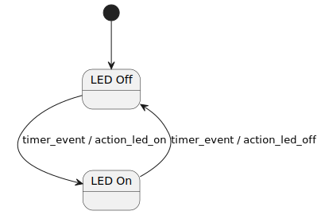

# SML library State-Machine in CH32V003

This is an example project where [boost-ext/sml](https://github.com/boost-ext/sml) is used to create a very basic state machine for the popular RISC-V microcontroller CH32V003.

The file consist on a MounRiver Studio project.

Tested on a [WeAct CH32V003F4U6 Development Board][https://github.com/WeActStudio/WeActStudio.CH32V003CoreBoard]

## State Machine



## Code Summary

Add the SML library:

```C++
#include <sml.hpp>

using namespace boost::sml;
```

Create the state machine and the events:

```C++
struct timer_event {};

auto action_led_on = [] {
		GPIO_WriteBit(GPIOC, GPIO_Pin_4, Bit_SET);
};
auto action_led_off = [] {
		GPIO_WriteBit(GPIOC, GPIO_Pin_4, Bit_RESET);
};

class BlinkingLED {
public:
   auto operator()(){
     return make_transition_table(
       *"state_led_off"_s + event<timer_event> / action_led_on ="state_led_on"_s
      ,"state_led_on"_s + event<timer_event> / action_led_off ="state_led_off"_s
   );
   }
};
```

Dispatch the timer_event wherever suits:

```C++
while(1)
{
Delay_Ms(500);
state_machine.process_event(timer_event{});
}
```
